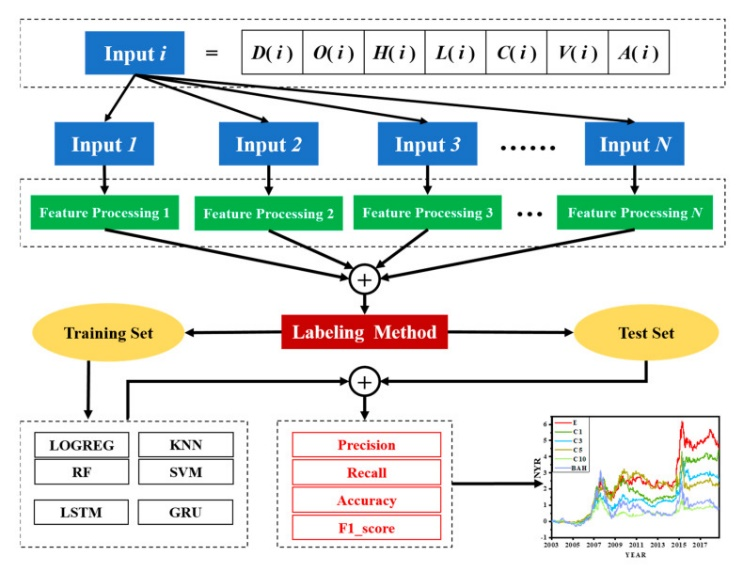
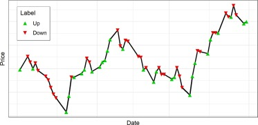
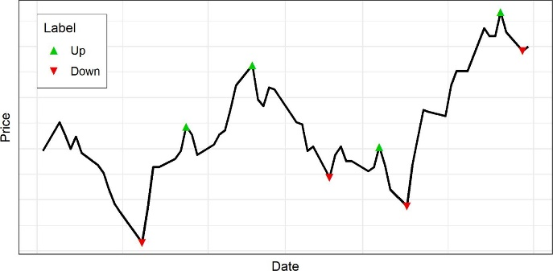

# N-Period Min Max Prediction Through Stable Rule Set Classifiers for Financial Trading Signals
## Authors: Varun Bhatnagar, Miranda Goodman 
This project needs Julia 1.9 to run. It also needs a valid Python distribution as it will install Python dependencies.

Package dependencies

Plots, LinearAlgebra, Statistics, DataFrames, CSV, NLsolve, Memoize, MLJBase, Pkg, MLJModels, ScikitLearn, Flux, Zygote, StatsBase, PyCall, Dates, MLJParticleSwarmOptimization, StatisticalMeasures, MLJTuning, Distributions, MethodChains, SIRUS, EvoTrees

Python Dependencies

ta, pandas, pandas_datareader, yfinance

Results are stored in the notebooks folder under airlines.ipynb, beverages.ipynb, and tech.ipynb. Data download commences on the first run, ensure that you have a stable internet connection. Startup and first recompilation times for Julia are long and Python dependencies will be downloaded by the script itself on the first launch to its own Anaconda environment. The Julia installations, Python installations, and data downloads can take more than 10 gigabytes of space, be aware of space constraints when downloading data. Unfortunately, julia's package manager at this time does not allow for sending a requirements.txt, Packages can be downloaded with these commands.

```
using Pkg
Pkg.add(split("Plots LinearAlgebra Statistics DataFrames CSV NLsolve Memoize MLJBase MLJModels ScikitLearn Flux Zygote StatsBase PyCall Dates MLJParticleSwarmOptimization StatisticalMeasures MLJTuning Distributions SIRUS EvoTrees", " "))
Pkg.add(url="https://github.com/uniment/MethodChains.jl")
```

# Introduction

Stock market forecasting and trading strategies have been extensively
studied by statisticians when concerning traditional statistical models.
<span class="mark">Numerous companies and strategies exist to profit off
even traditional forecasting methods, however, with the advent of newer
machine learning techniques like Gradient Boosted Trees, Long-Term
Short-term memory networks, and even Transformer models, long standing
assumptions of the inability of previous data to create profitable
trading strategies above the average annualized returns of a single
stock have been challenged.</span> We hope to show that a novel
combination of machine learning techniques can outperform previous
methods and generate profitable returns despite the stochastic nature of
financial data, particularly financial securities relating to the
various sectors of the American Market.

This study seeks to answer the following research questions:

1\. Can a higher profit margin be achieved using NPMM labeling along
with financial feature engineering methods and a Stable and
Interpretable Rule Sets model?

2\. How do Stable Rule Set models compare to Gradient Boosted Tree
Methods within financial time series modeling?

3\. What are the decisions being made by Stable Rule Set models in
regard to financial engineering

The focus of this research is to optimize a trading strategy pursuant to
buying and selling assets at optimal times. Given model predictions, we
emit a <span class="mark">buy</span> or <span class="mark">sell</span>
signal which alternates over some interval. We must buy the asset to
sell it and must sell the asset before buying again. This gives a
simplistic view of markets where we cannot sell without holding the
asset at all (short the asset) or simply buy more of the asset over a
time interval. However, the evaluation of trading strategies that
consider multiple buys, sells, shorts, and other financial derivatives
makes validation difficult. Thus, we stick to our simple trading
strategy for evaluation. 

The difficulty in justifying the use of this financial strategy is in
considering the opportunity cost of holding the asset or buying and
<span class="mark">then</span> not selling the asset till the end of the
time interval. Consider a risk-free asset that grows at a constant rate.
<span class="mark">In the absence of volatility, it would not be optimal
to sell the asset after buying before the end of the interval as we keep
expecting the asset to increase in value, thus selling the asset and
then buying at a later date only disqualifies us from collecting the
appreciation of the asset over the interval where we did not hold
it.</span> While the financial securities we are concerned about are not
risk free, the sentiment generally holds. <span class="mark">Optimal
trades, periods of times before paired and ordered buys and sells, must
occur when the asset is undervalued to when the asset is overvalued to
profit from the volatility. However, that volatility is difficult to
predict and makes our opportunity cost not only money we may lose on the
trade but also that profit relative to the appreciation of the
underlying asset.</span> The rise of machine learning techniques like
XGBoost and Deep Learning have led to many being able to create
theoretically profitable methods. The method we plan on implementing is
a Stable Rule Set Classifier (SBC) and a XGBoost model.

Additionally, the response variable for supervised machine learning
models is not well defined and several competing labeling techniques
exist within this space. One prominent example within the literature is
up-down labeling, where we label whether an asset at any given time step
will go up or down one time interval in the future. Difficulties with
this strategy are with volatility of the stock. While a less difficult
problem on paper than forecasting, much of the problems with both
remain. For example, the naïve assumption that the asset will rise if
the asset rose in the previous interval or vice versa can become a
suboptimal convergence point for algorithms of this nature. The response
itself is also noisy and relates heavily to the volatility of the underlying
asset (Han, Y., Kim, J., & Enke, D. (2023)). While up-down labeling
makes this a classification problem, the realm of regression where a
signal is emitted given some threshold of model output is littered with
failed methods. While continuous label methods hope to overcome the
biases relating to categorical methods, the difficulty comes in
adjusting for look-ahead bias, where the label itself relies heavily on
future data to set a target using a past interval and becomes too
difficult to predict while also retaining the model's volatility (We et.
all 2020). N-Period Min Max Labeling hopes to address failures in
categorical methods by creating a simple and learnable label. Another
difficulty with supervised learning for financial time series is feature
engineering. Financial assets generally come with five features- the
opening price over the interval, closing price, high price, low price,
and volume of assets traded. There has been a large effort by technical
traders to create a variety of indicators based of these features
including looking at how values modulate over time to create an
extensive set of variables that could be related to our response. We use
a combination of feature selection techniques and Partial Least Squares
regression to attempt to capture as much relevant information from these
indicators as possible.



Figure 1. <span class="mark">Visual of modeling process (Wu et. all,
2020)</span>

<span class="mark">Figure 1 represents the general process necessary for
implementing our various techniques.</span> We plan on using N-Period
Min Max Labeling for our Labeling Method, a Stable Rule Set Classifier
and a XGBoost model, and Partial Least Squares Regression for our
feature processing.

#  LITERATURE REVIEW

## NPMM Labeling

This study uses a labeling strategy and data sources from the paper
written by Han, Y., Kim, J., & Enke, D. (2023). The labeling schema is
an N-period min max labeling technique which identifies the local
maximums and minimums of a stock trade only labeling at definite time
points in the stock trade. Then for a trading strategy, one would want
to sell a stock at the maximum (When the stocks are worth the most) and
buy at the minimum (When the stock is not worth much). There has not
been much prior work done on NPMM labeling in the financial world. Much
research prior to the work done by Han, Y., Kim, J., & Enke, D. (2023)
who attempted to label all points in the stock market using up-down
labeling - a strategy that led to small price change sensitivity and
inaccurately labeled training sets. Up-down labeling views all changes in
the stock market as being equally important, which is not always the
case. *Wu, Wang, Su, Tang,* and *Wu* (2020) found that up-down labeling does
not accurately predict continuous trends in the stock market. This
created flaws between the data labels and the actual market results.
With NPMM only labeling at definite points, it allows the training set
to not be as affected by small price changes. The data for both this
study and the work done by Han, Y., Kim, J., & Enke, D. (2023) comes
from Yahoo Finance.



Figure 2. <span class="mark">Visual of Up Down Labelling (Han et al.,
2023)</span>

<span class="mark">Up-down labeling is only looking at the overall trend
of the market. Are the trends going up or are they going down? In figure
2 the green triangle symbols show when the stock trends are increasing,
and the red triangle symbols show when the stock trends are decreasing.
This approach to stock market analysis is almost oversimplified because
it is susceptible to small price change variability, something that is
avoided with NPMM labeling.</span>

## Technical Indicators and PLS

Through the use of technical indicators paired with both our models this
research aims to achieve higher accuracy results. A technical indicator
is on a per stock basis, and it is a measurement or calculation that
provides one with some kind of information about the stock. Combining
these indicators forms trading strategies. One of the most used
technical indicators is MACD which looks at the direction a stock is
headed. It summarizes if a stock is moving upward (meaning the stock is
worth more money) or downward (meaning we're losing money). MACD also
looks at how strongly the stock is moving in that direction and for how
long. Using this information in combination with other indicators gives
a stronger understanding of the overall market. This research was
exemplified by the work of Wen, C., Zhu, H., & Dai, Z. (2023) who
combined over 100 different technical indicators and used a PLS strategy
for reduction. *Kelly* and *Pruitt* (2013, 2015) developed the PLS
method, but it was the work of *Huang et al.* (2015), *Stivers* (2018),
and *Hoang et al.* (2020) that showed the reliability and superior
performance of PLS compared to other reduction techniques. This research
will use PLS to do reduction on the technical indicators. PLS finds a
limited set of variables that maximizes covariance between independent
and dependent variables. Even for classification tasks, PLS can
outperform Linear Discriminate Analysis or LDA when there lacks
similarity between the covariance of independent variables to the
dependent variables. LDA is also used for dimensionality reduction but
makes assumptions that the independent and dependent variables have the
same covariance which is not the case with stock market prediction. PLS
does not make this assumption. PCA is also usually thought of for
dimensionality reduction but can easily struggle when handling noisy
data. The stock market has very noisy data and Wen, C., Zhu, H., & Dai,
Z. (2023) research found that PLS is better at handling these types of
data sets.

## Stable Interpretable Rule Sets

Gradient Boosted Tree models have become common place for modeling
tabular datasets. Difficulties in their use arise when considering the
interpretability of their predictions, especially for applications where
potential mishaps equate to incorrigible losses. While better
understanding of model insights may not increase any empirical accuracy,
human trust in models and evaluation of the decision-making processes of
black-box models have become a prominent field of study. State of the
art methods like Shapely Additive Explanations (SHAP) assign feature
importance per instance which can be averaged over a set of predictions
to get a better understanding of how features are used in the model
(Lundberg, 2017).

Instead of assessing interpretability through feature importance, Stable
Interpretable Rule Set (SIRUS) models give a set of rules whose
conditions contribute additively to the prediction.
<span class="mark">These models fit random forests composed of shallow
decision trees and extract a set of rules which when a condition is
met increase the model's certainty in the prediction of a classification
target.</span> SIRUS models inherit performances of random forests while
exhibiting robustness to data perturbations, and within the context of
noisy financial time series data, these properties make the model an
interesting candidate for implementation of trading strategies. (Bénard
et al., <span class="mark">2019)</span>

# Novel Implementation

This research was completed in stages to accurately predict stock market
trends. The first stage was the gathering and labeling of the data.
Stock market data is noisy and difficult to analyze when considering
small price change variability. This research addresses these concerns
achieving a solution that is unique from most historical labeling
methods. This study then considers many of the market and technical
indicators as features. There were 92 technical indicators applied to
one stock at a time and 5 market indicators. PLS will be used as a
reduction technique on the technical indicators and will be added to the
list of indicators, but there is still a significant amount of
hyperparameters being used in the model. To reduce the hyperparameters
we will use an adaptive particle swarm cross validation which reduces
the grid for optimizing our parameters. The data and features will be
fed into a gradient boosted tree model and a stable rule regressor.
These models will be validated using a time series cross validation.

## Data Sets

The data set used in this paper comes from Yahoo Finance and contains
data from the United States stock market for years 2000 until 2022.
Stock trends from 2000 until 2021 will be used as training data and
stock market data from 2022 will be unseen data used for testing. We
will specifically be looking at various assets grouped by type. For
example, we will be looking at technology stocks which include Apple,
Microsoft, Google, and Tesla. We will also be looking at beverage stocks
like the Coco-Cola company. A full list of stocks used for training can
be found in our results section.

Financial assets generally come with five features- the opening price,
closing price, high price, low price, and volume of assets traded over
each interval. This holds true for this study. We use a combination of
feature selection techniques and PLS regression to capture as much
relevant information from both these features and our technical
indicators as possible.

## Labeling Schema

This study uses an NPMM labeling schema combined with both market and
technical indicators to predict stock market trends. Remember from
previous studies, NPMM labeling does not always have the highest win
ratio of a labeling strategy especially when compared to up-down
labeling. However, NPMM labeling had a higher profit factor than other
labeling strategies. When we think about stock market prediction, we
care less about accuracy and more about profit. So, breaking this down
further, when NPMM labels a trade, it is not always correct even
compared with other labeling schemas. Though when NPMM labeling is
right, it is right by significantly more than other labeling schemas and
when NPMM labeling is wrong it is less wrong compared to the other
schemas. This means when using NPMM labeling as a schema, we have a
higher probability of making money even though it is less accurate than
other models. NPMM labeling is described in figure 3 below. A NPMM
labeling technique identifies the local maximums and minimums of a stock
trade only labeling at definite time points in the stock trade. In
figure 3 the maximums are labeled in green, and the minimums are labeled
in red. For a trading strategy, one would want to sell a stock at the
maximum (When the stocks are worth the most) and buy at the minimum
values (When the stock is not worth much).



<span class="mark">Figure 3: Diagram showing an NPMM labeling
schema.</span>

## Using Technical and Market Indicators

We will pair each stock from our data set sample (Tesla, apple, and
beverage stocks) with five market indicators: S&P 500, NASDAQ, VIX
score, Dow Jones Industrial Average, and the Russel 2000 index. The S&P
500 stands for the Standard and Poor 500. It is a stock market index
that looks at the largest 500 companies in the United States and how
much of an influence each of them has over the market based on a market
capitalization index. It is one of the single largest indicators of how
the stock market is doing as a whole. The NASDAQ is similar to the S&P
500, but only looks at tech companies and how they are influencing the
stock market. The NASDAQ incorporates the market capitalization of over
3000 tech companies. The VIX score looks at the volatility of the market
and analyzes the likelihood of stock market trends drastically changing.
It is often referred to more commonly as the fear index because when the
entire market moves drastically it usually means that a lot of stocks
are going to drop quickly. Stocks rarely will drastically move up all at
once, but they all can drop at the same time. This was seen most
recently during the economic trouble in 2008 and during the COVID 19
pandemic. The Dow Jones Industrial Average looks at larger publicly
owned companies with the idea that the companies with greater stocks
have greater control over the performance of the stock market. The
Russel 2000 index is almost the opposite of the S&P 500. Instead of
looking at bigger-sized companies with a greater market capitalization,
Russel 2000 looks at larger companies but with a lot of small market
capitalization.

<span class="mark">This study applied 92 technical indicators for each
stock and market indicator making a matrix to analyze 552 x N
values.</span> 552 is obtained by multiplying our 92 indicators by the
specific stock and by the 5 market indicators.

# Methodology

## Data Preparation

We obtained market data from the earliest year data was available for a
specific asset after 2000 to 2022. We then used the *ta* library in
python to add technical indicators to each of the training datasets. We
concatenated the columns of our axillary market indicators to each of
the tickers present in our composites. We then used PLS to create an
additional feature for our training dataset on top of the other
technical indicators present.

## Model Selection

Due to the large search space of possible Gradient Boosted Tree
Parameters, we opted to use an Adaptive Particle Swarm Approach with
resampling done through Cross Validation. We used a Time Series Cross
Validation Split on the N-Period Min Max data from 2000 to 2021 for
hyperparameter tuning. Model selection during hyperparameter tuning was
conducted by comparing the Briar Loss of probabilistic predictions made
by EvoTree and Stable Rule Set Classifiers to whether or not an extremum
was a min or max. We used 3 particles for each step and trained a total
of 50 models. For our Stable Rule Set Classifier, we opted to use
default settings as listed by the Julia <span class="mark">SIRUS.JL
package</span>. We did not record significant change in performance due
to parameter tuning for Stable Rule Set Classifiers.

> (J. Zhang et al., <span class="mark">2011)</span>

## Evaluation Criteria

For evaluation purposes, we held 2022 from training. For evaluating the
test set, a different methodology was used. <span class="mark">Instead
of attempting to predict whether or not a point was a local extremum and
then classify it as a minimum or maximum, all instances in the test were
classified, then a signal to sell was generated if the probability of
the prediction was greater than some threshold θ, and a signal to buy if
less than 1 – θ.</span> Threshold values lie between 0.5 and 1, the
choice impacting the amount of trade and confidence of whether the trade
would represent buying or selling at the appropriate extrema.

While signals generated may not be alternating, in evaluation given a
buy signal we only buy if we are not holding the asset and given sell
signal we only sell if holding the asset. We consider signals that are
acted on buy orders and sell orders. Applying this strategy to the time
series could lead to misleading results, particularly if at the end of
the time series we are still holding the asset. Instead, we consider the
performance of trades, or pairs of buy orders and sell orders.
<span class="mark">Considering that the value of a trade per asset is
the sale price minus the buy price, we looked at the mean value of
trades, the standard deviation, mean value of winning trades or trades
that are positive, the mean value of losing trades or trades that are
negative, and the win rate or percentage of trades that are
positive.</span>

We split our evaluation data over three composites, tech, beverage, and
<span class="mark">airline</span>. <span class="mark">Tech assets are
generally high growth, however 2022 presents an interesting case study
on the performance of the algorithm given that 2022 represented a period
of high volatility with a sharp decline in the first 3 quarters and
uptick in the last.</span> Beverage assets are generally stable and
airline assets are just another easily grouped asset class we could
train to show some amount of generalization.

#  Results

<span class="mark">The following represent performance by EvoTree
(XGBoost implementation in Pure Julia) and Stable Rules Classifier
performance all at thresholds of 80%.</span>

Note: predictions are modes of possible categories, for thresholding we
took the ratio of predicted categories instead of the value for each,
i.e. If a class must be chosen what is the probability of it being
positive. For Stable Rule Set Classifiers consider that the output is
normalized with respect to the possible maximum of the decisions.

EvoTrees/XGBoost =&gt; GBT, Stable Rule Set Classifier =&gt; SBC

## Beverages

Tickers: "KO", "PEP", "CELH", "MNST", "KDP", "FIZZ", "BUD", "SBUX", "TAP"

<table>
<colgroup>
<col style="width: 35%" />
<col style="width: 64%" />
</colgroup>
<thead>
<tr class="header">
<th>Win Rate GBT/SBC</th>
<th>70.91% / 70.00%</th>
</tr>
</thead>
<tbody>
<tr class="odd">
<td>Mean GBT/SBC Value of Trade</td>
<td>$0.156 / $0.265</td>
</tr>
<tr class="even">
<td>Std. GBT/SBC Value of Trade</td>
<td>$2.363 / $2.742</td>
</tr>
<tr class="odd">
<td>Mean GBT/SBC Win</td>
<td>$ 0.985 / $ 1.253</td>
</tr>
<tr class="even">
<td>Mean GBT/SBC Loss</td>
<td>$-1.880 / $-2.067</td>
</tr>
<tr class="odd">
<td>Mean GBT/SBC NPMM return rate</td>
<td>15.826 % / 18.612%</td>
</tr>
<tr class="even">
<td>Std. GBT/SBC NPMM Return Rate</td>
<td>27.489% / 21.576%</td>
</tr>
<tr class="odd">
<td>Mean Asset Return Rate</td>
<td>4.553 %</td>
</tr>
<tr class="even">
<td>Std. Asset Return Rate</td>
<td>14.733 %</td>
</tr>
</tbody>
</table>

Time Series Cross Validation Accuracy

<table>
<colgroup>
<col style="width: 15%" />
<col style="width: 16%" />
<col style="width: 17%" />
<col style="width: 17%" />
<col style="width: 17%" />
<col style="width: 17%" />
</colgroup>
<thead>
<tr class="header">
<th></th>
<th>Fold 1</th>
<th>Fold 2</th>
<th>Fold 3</th>
<th>Fold 4</th>
<th>Fold 5</th>
</tr>
</thead>
<tbody>
<tr class="odd">
<td>GBT</td>
<td>91.9%</td>
<td>92.7%</td>
<td>94.2%</td>
<td>91.5%</td>
<td>91.1%</td>
</tr>
<tr class="even">
<td>SBC</td>
<td>82.1%</td>
<td>87.1%</td>
<td>76.1%</td>
<td>77.8%</td>
<td>83.7%</td>
</tr>
</tbody>
</table>

Best Hyper Parameters GBT

<table>
<colgroup>
<col style="width: 31%" />
<col style="width: 68%" />
</colgroup>
<thead>
<tr class="header">
<th>Max Depth</th>
<th>4</th>
</tr>
</thead>
<tbody>
<tr class="odd">
<td>Column Sample</td>
<td>56.213 %</td>
</tr>
<tr class="even">
<td>Row Sample</td>
<td>38.569%</td>
</tr>
<tr class="odd">
<td>Learning Rate</td>
<td>1.0</td>
</tr>
<tr class="even">
<td>Number of Rounds</td>
<td>21</td>
</tr>
<tr class="odd">
<td>L2 Regularization</td>
<td>0.0</td>
</tr>
<tr class="even">
<td>Alpha Regularization</td>
<td>0.456</td>
</tr>
<tr class="odd">
<td>Lambda regularization</td>
<td>3.127</td>
</tr>
<tr class="even">
<td>Gamma Regularization</td>
<td>0.0</td>
</tr>
<tr class="odd">
<td>Minimum Weight</td>
<td>3.0</td>
</tr>
<tr class="even">
<td>Number of Bins</td>
<td>97</td>
</tr>
<tr class="odd">
<td>Tree Type</td>
<td>Binary</td>
</tr>
</tbody>
</table>

SBC Logic

if Stochastic &lt; 67.058784 then 0.003 else 0.02 +

if Williams %R &lt; -32.94121 then 0.003 else 0.02 +

if Keltner Channel P Band &lt; 0.7670374 then 0.002 else 0.015 +

if Keltner Channel H Indicator Band &lt; 1.0 then 0.012 else 0.058 +

if Stochastic RSI &lt; 0.64570004 then 0.003 else 0.019 +

if Williams %R &lt; -50.015392 then 0.0 else 0.001 +

if Bollinger Band P Band &lt; 0.65591186 then 0.004 else 0.023

## Technology

Tickers: "AAPL", "MSFT", "NVDA", "ORCL", "AMZN", "GOOG", "INTC", "META",
"TSLA"

<table>
<colgroup>
<col style="width: 35%" />
<col style="width: 64%" />
</colgroup>
<thead>
<tr class="header">
<th>Win Rate GBT/SBC</th>
<th>61.23% / 56.65%</th>
</tr>
</thead>
<tbody>
<tr class="odd">
<td>Mean GBT/SBC Value of Trade</td>
<td>$-1.209 / $ -3.529</td>
</tr>
<tr class="even">
<td>Std. GBT/SBC Value of Trade</td>
<td>$ 9.875 / $19.816</td>
</tr>
<tr class="odd">
<td>Mean GBT/SBC Win</td>
<td>$ 3.390 / $4.374</td>
</tr>
<tr class="even">
<td>Mean GBT/SBC Loss</td>
<td>$ -8.548 / $-13.858</td>
</tr>
<tr class="odd">
<td>Mean GBT/SBC NPMM return rate</td>
<td>‑30.482% / ‑30.066%</td>
</tr>
<tr class="even">
<td>Std. GBT/SBC NPMM Return Rate</td>
<td>14.674% / 17.293%</td>
</tr>
<tr class="odd">
<td>Mean Asset Return Rate</td>
<td>-43.221 %</td>
</tr>
<tr class="even">
<td>Std. Asset Return Rate</td>
<td>19.574 %</td>
</tr>
</tbody>
</table>

Time Series Cross Validation Accuracy

<table>
<colgroup>
<col style="width: 15%" />
<col style="width: 16%" />
<col style="width: 17%" />
<col style="width: 17%" />
<col style="width: 17%" />
<col style="width: 17%" />
</colgroup>
<thead>
<tr class="header">
<th></th>
<th>Fold 1</th>
<th>Fold 2</th>
<th>Fold 3</th>
<th>Fold 4</th>
<th>Fold 5</th>
</tr>
</thead>
<tbody>
<tr class="odd">
<td>GBT</td>
<td>91.9%</td>
<td>92.7%</td>
<td>94.2%</td>
<td>91.5%</td>
<td>91.1%</td>
</tr>
<tr class="even">
<td>SBC</td>
<td>82.1%</td>
<td>87.1%</td>
<td>76.1%</td>
<td>77.8%</td>
<td>83.7%</td>
</tr>
</tbody>
</table>

Best Hyper Parameters GBT

<table>
<colgroup>
<col style="width: 31%" />
<col style="width: 68%" />
</colgroup>
<thead>
<tr class="header">
<th>Max Depth</th>
<th>6</th>
</tr>
</thead>
<tbody>
<tr class="odd">
<td>Column Sample</td>
<td>41.541%</td>
</tr>
<tr class="even">
<td>Row Sample</td>
<td>28.421%</td>
</tr>
<tr class="odd">
<td>Learning Rate</td>
<td>0.2055</td>
</tr>
<tr class="even">
<td>Number of Rounds</td>
<td>21</td>
</tr>
<tr class="odd">
<td>L2 Regularization</td>
<td>1.076</td>
</tr>
<tr class="even">
<td>Alpha Regularization</td>
<td>0.515</td>
</tr>
<tr class="odd">
<td>Lambda regularization</td>
<td>0.0</td>
</tr>
<tr class="even">
<td>Gamma Regularization</td>
<td>10.0</td>
</tr>
<tr class="odd">
<td>Minimum Weight</td>
<td>5.0</td>
</tr>
<tr class="even">
<td>Number of Bins</td>
<td>74</td>
</tr>
<tr class="odd">
<td>Tree Type</td>
<td>Binary</td>
</tr>
</tbody>
</table>

SBC Logic

if Keltner Channel P Band &lt; 0.80790466 then 0.002 else 0.012 +

if Williams %R &lt; -29.655165 then 0.003 else 0.016 +

if Stochastic &lt; 70.34483 then 0.003 else 0.017 +

if Keltner Channel L Indicator Band &lt; 1.0 then 0.119 else 0.006 +

if Bollinger Band P Band &lt; 0.6683319 then 0.005 else 0.02 +

if Keltner Channel H Indicator Band &lt; 1.0 then 0.007 else 0.032

## Airlines

Tickers: "AAL", "CPA", "DAL", "UAL", "AAL", "ALK"

<table>
<colgroup>
<col style="width: 35%" />
<col style="width: 64%" />
</colgroup>
<thead>
<tr class="header">
<th>Win Rate GBT/SBC</th>
<th>67.56% / 59.77%</th>
</tr>
</thead>
<tbody>
<tr class="odd">
<td>Mean GBT/SBC Value of Trade</td>
<td>$-0.044/ $ -0.131</td>
</tr>
<tr class="even">
<td>Std. GBT/SBC Value of Trade</td>
<td>$ 2.007/ $2.613</td>
</tr>
<tr class="odd">
<td>Mean GBT/SBC Win</td>
<td>$ 0.774/ $1.079</td>
</tr>
<tr class="even">
<td>Mean GBT/SBC Loss</td>
<td>$ -1.795/ $-1.955</td>
</tr>
<tr class="odd">
<td>Mean GBT/SBC NPMM return rate</td>
<td>-8.969% / -13.609%</td>
</tr>
<tr class="even">
<td>Std. GBT/SBC NPMM Return Rate</td>
<td>13.116% / 11.491%</td>
</tr>
<tr class="odd">
<td>Mean Asset Return Rate</td>
<td>-20.084%</td>
</tr>
<tr class="even">
<td>Std. Asset Return Rate</td>
<td>11.876%</td>
</tr>
</tbody>
</table>

Best Hyper Parameters GBT

<table>
<colgroup>
<col style="width: 31%" />
<col style="width: 68%" />
</colgroup>
<thead>
<tr class="header">
<th>Max Depth</th>
<th>4</th>
</tr>
</thead>
<tbody>
<tr class="odd">
<td>Column Sample</td>
<td>60.229%</td>
</tr>
<tr class="even">
<td>Row Sample</td>
<td>28.594%</td>
</tr>
<tr class="odd">
<td>Learning Rate</td>
<td>0.68171</td>
</tr>
<tr class="even">
<td>Number of Rounds</td>
<td>25</td>
</tr>
<tr class="odd">
<td>L2 Regularization</td>
<td>6.167</td>
</tr>
<tr class="even">
<td>Alpha Regularization</td>
<td>0</td>
</tr>
<tr class="odd">
<td>Lambda regularization</td>
<td>1.0083</td>
</tr>
<tr class="even">
<td>Gamma Regularization</td>
<td>1.5328</td>
</tr>
<tr class="odd">
<td>Minimum Weight</td>
<td>1.0</td>
</tr>
<tr class="even">
<td>Number of Bins</td>
<td>125</td>
</tr>
<tr class="odd">
<td>Tree Type</td>
<td>Binary</td>
</tr>
</tbody>
</table>

Time Series Cross Validation Accuracy

<table>
<colgroup>
<col style="width: 15%" />
<col style="width: 16%" />
<col style="width: 17%" />
<col style="width: 17%" />
<col style="width: 17%" />
<col style="width: 17%" />
</colgroup>
<thead>
<tr class="header">
<th></th>
<th>Fold 1</th>
<th>Fold 2</th>
<th>Fold 3</th>
<th>Fold 4</th>
<th>Fold 5</th>
</tr>
</thead>
<tbody>
<tr class="odd">
<td>GBT</td>
<td>90.1%</td>
<td>91.7%</td>
<td>90.9%</td>
<td>91.9%</td>
<td>91.9%</td>
</tr>
<tr class="even">
<td>SBC</td>
<td>80.8%</td>
<td>74.1%</td>
<td>79.2%</td>
<td>84.6%</td>
<td>81.1%</td>
</tr>
</tbody>
</table>

SBC Logic

if Keltner Channel L Indicator Band &lt; 1.0 then 0.139 else 0.013 +

if Stochastic &lt; 66.666664 then 0.002 else 0.014 +

if Stochastic RSI &lt; 0.6425483 then 0.004 else 0.015 +

if Williams %R &lt; -51.76471 then 0.001 else 0.004 +

if Daily Returns &lt; 0.3911308 then 0.001 else 0.004 +

if Keltner Channel H Indicator Band &lt; 1.0 then 0.008 else 0.034 +

if Keltner Channel P Band &lt; 0.7508161 then 0.002 else 0.009

# Discussion

## Reliability of Results

During the evaluation year of 2022, the model outperformed the
underlying asset composites, and for most well-performing assets
outperformed the S&P 500 index. However, there are several reasons why
this performance may not be indicative of broader algorithmic
effectiveness. Notably, the evaluation year, 2022, saw large downturns
for many industries leading the S&P 500 to decrease by ‑19.64%. As the
technology sector saw the largest depreciation, our composite assets
returned an average of ‑43.22%. It also does not benefit us to not
consider market conditions in 2022 in the assessment of our models,
financial phenomena happen constantly and the ability of trading
strategies to be more profitable than the overall market in adverse
conditions is surprising and speaks to the effects of the labeling
method involved. However, further composites and market conditions must
be evaluated to ascertain whether these models can result in long-term
gains.

## Comparison of Gradient Boosted Trees and Stable Rule Sets

While EvoTrees/XGBoost performed better on N-Period Min Max
classification, they did not generate better profit for beverage and
technology composites. This highlights the discrepancy between our
prediction target and our evaluation metrics. Increases in validation
accuracy of local extrema classification do not necessarily lead to
increased profits. Stable Rule Set Classifiers did not seem to select
any auxiliary features, preferring momentum and volatility-based
indicators of the underlying asset itself. <span class="mark">While this
may vary with increasing the maximum amount of rules, the performance of
both GBT and SBC models were not so different as to justify the
computational or interpretability cost of using GBT models or increasing
the complexity of SBC models.</span>

SBC models tended to have a higher absolute value of mean trades,
suggesting that time intervals between orders were higher.

## Feature Selection

<span class="mark">In our evaluation even with emphasis on feature
reduction techniques, it is not clear whether feature selection will
heavily influence the outputs of these experiments especially given the
validation scores of the models involved.</span> There may be a wide
range of potential feature interactions present with the given technical
indicators that produce well-performing classifiers.
<span class="mark">Heavy regularization penalties employed in our
hyperparameter search is a definite indicator of collinearity and noise
within our feature set, but the Stable Rule Set Classifier was able to
see past the nearly 400 features unrelated to the asset being evaluated
and pin 7 rules that have some theoretical substance.</span> Keltner and
Bollinger bands are often thought of as predictions on price floors and
ceilings, while Stochastic, Stochastic RSI, and Williams %R can be used
to indicate over buying or selling, which represent changes in price
direction. PLS is not present in the SBC logic, which should be expected
as feature reduction generally leads to less interpretable results (Liu
& Motoda, 2002).

# Future Work

## NPMM Labeling as Instance Selection

As we and the authors of the N-Period Min Max Labeling paper have
applied the method, it functions less as a true target and more a method
of instance selection. Instance selection is a family of methods that
increase data quality by removing noise or difficult to classify data
points that <span class="mark">may affect</span> the rest of the time
series model. The target provided by NPMM labeling at first glance seems
tangentially related to a trading strategy. <span class="mark">We cannot
be certain in a testing environment whether a point is or is not an
extremum, however, local extremas seem to provide valuable information
on price direction that applies to all points in the time series.</span>
If this form of instance selection is robust, it may be applicable to
more informative targets, such as opportunity cost or even forecasting
methods (Liu & Motoda, 2002).

## Paper Trading Implementation

SBC models produce interpretable and easily programmable models that can
be implemented on a variety of architectures and platforms. One such
platform to consider would be Pine Script, a language by Trading View
meant for back testing trading strategies. <span class="mark">Other
platforms exist that can be implemented with Julia and Python such as
Alpaca, that can be used to test the model's ability in a real
environment with fees for making transactions, potential non-liquidity,
and other fun problems that do not appear in simulated trading.</span>

## Fuzzy Inference Models

The connection between Stable Rule Set Classifiers and Fuzzy Inference
models is most apparent when considering their outputs. Both produce
rules that have an additive effect on the output, however, fuzzy
inference makes rules from fuzzy sets while Stable Rule Set Classifiers
use deterministic sets. For example, if we were to want to predict
whether or not it rains tomorrow, we might consider 2 variables,
humidity, and temperature. A stable rule set classifier may arrive at a
rule like if the temperature is less than 50 degrees and humidity is greater
than 70% then it will rain. Fuzzy inference systems create fuzzy sets
for which a data point can have a chance of belonging. For example,
the model may output a rule like if it is cold and humid it will rain.
The probability a point may be in the category cold could be Gaussian
centered at 30 degrees while humid is also Gaussian centered at 90%. We can
then calculate the probability that the rule is true based on the
probability that the point falls into the sets cold and humid.
<span class="mark">They both provide interpretable rule sets, but fuzzy
inference systems can communicate the confidence of a prediction based
on the probability that new data points fit with previously established
categories, which could lead to trading strategies that prevent losses
when market conditions change and make the model potentially
unprofitable (Hassanniakalager et. al 2020)</span>.

# Concluding thoughts

Going over the research questions we posed in our introduction, we now
have insight into these answers.

1.  Can a higher profit margin be achieved using NPMM labeling along
    with financial feature engineering methods and a Stable and
    Interpretable Rule Sets model?

While both methods outlined in this paper seem to outperform composites
and the overall market, it is difficult to truly validate the use of
these algorithms have given market anomalies in 2022. Paper trading or live
trading over an extended period of time may increase our confidence in
these methods.

1.  How do Stable Rule Set models compare to Gradient Boosted Tree
    Methods within financial time series modeling?

Stable Rule Set Models seem to outperform Gradient Boosted Tree Models
in conditions where stocks are generally non-volatile with growth rates.

1.  What are the decisions being made by Stable Rule Set models in
    regard to financial engineering

Stable Rule Set Models seem to prefer the individual stock's momentum and
volatility-based technical indicators, forgoing PLS and auxiliary market
indicators. More complex models may turn to these indicators, however,
the trade-off between interpretability and complexity still exists. It
may not be worth using more complex models given the simplicity and near
equivalence of profitability between Gradient Boosted Trees and Stable
Rule Set Models.

##### References

1.  <span class="mark">htBénard, C., Biau, G., Veiga, S. da, &
    Scornet, E. (2019, August 19).</span> <span class="mark">*SIRUS:
    Stable and interpretable rule set for classification*.</span>
    arXiv.Org. <span class="mark">h.s://arxiv.org/abs/1908.06852</span>

2.  Chang, P. C., Liu, C. H., & Lai, R. K. (2008). *A fuzzy case-based
    reasoning model for <span class="mark"></span>sales forecasting in
    print circuit board industries. Expert Systems with Applications*,
    34(3), 2049–2058.

3.  G. Eason, B. Noble, and I. N. Sneddon, “*On certain integrals of
    Lipschitz-Hankel type <span class="mark"></span>involving products
    of Bessel functions*,” Phil. Trans. Roy. Soc. London, vol. A247, pp.
    529–551, April 1955. *(references)*

4.  Gradojevic, N., & Gençay, R. (2013). Fuzzy logic, trading
    uncertainty and technical <span class="mark"></span>trading. Journal
    of Banking & Finance, 37(2), 578–586.

5.  Han, Y., Kim, J., & Enke, D. (2023). *A machine learning trading
    system for the stock <span class="mark"></span>market based on
    N-period Min-Max labeling using XGBoost*. Expert Systems with
    <span class="mark"></span>Applications, 211, 118581.
    doi<span class="mark">:10.1016/j.eswa.2022.118581</span>

6.  Hassanniakalager, A., Sermpinis, G., Stasinakis, C., & Verousis, T.
    (2020). A <span class="mark"></span>conditional fuzzy inference
    approach in forecasting. European Journal of Operational Research,
    283(1), 196–216. doi:10.1016/j.ejor.2019.11.006

7.  <span class="mark">Hoang, K., Cannavan, D., Huang, R., Peng, X.,
    2020.</span> *Predicting stock returns with implied cost of capital:
    a partial least squares approach.* J. Financ. Mark. 100576.

8.  Hruschka, H. (1988). *Use of fuzzy relations in rule-based decision
    support systems for <span class="mark"></span>business planning
    problems*. European Journal of Operational Research, 34(3), 326–335.

9.  Huang, D., Jiang, F., Tu, J., Zhou, G., 2015. *Investor sentiment
    aligned: a powerful predictor of stock returns*. Rev. Financ. Stud.
    28 (3), 791–837.

10. J. Zhang et al., "Evolutionary Computation Meets Machine Learning: A
    Survey," *in IEEE Computational Intelligence Magazine*, vol. 6, no.
    4, pp. 68-75, Nov. 2011, doi: 10.1109/MCI.2011.942584.

11. Kelly, B., Pruitt, S., 2013. *Market expectations in the
    cross-section of present values*. J. Financ. 68 (5), 1721–1756.

12. Kelly, B., Pruitt, S., 2015. *The three-pass regression filter: a
    new <span class="mark">approach to</span> forecasting using many
    predictors*. J. Econ. 186 (2), 294–316.

13. Kuo, R. J. (2001). *A sales forecasting system based on fuzzy neural
    network with initial <span class="mark"></span>weights generated by
    genetic algorithm*. European Journal of Operational Research,
    129(3), 496–517.

14. Liu, H., & Motoda, H. (2002, April 1). <span class="mark">*On issues
    of instance selection*.</span> Springer Nature.
    https://www.researchgate.net/publication/220451759\_On\_Issues\_of\_Instance\_Selection)

15. Lundberg, S., & Lee, S.-I. (2017, May 22). *A unified approach to
    interpreting model <span class="mark"></span>predictions*.
    arXiv.Org. https://arxiv.org/abs/1705.07874

16. Piramuthu, S. (1999). *Financial credit-risk evaluation with neural
    and neurofuzzy <span class="mark"></span>systems*. European Journal
    of Operational Research, 112(2), 310–321.

17. Stivers, A., 2018. *Equity premium predictions with many predictors:
    a risk-based <span class="mark"></span>explanation of the size and
    value factors.* J. Empir. Financ. 45, 126–140.

18. Teodorovic, ´ D. (1994). *Fuzzy sets theory applications in traffic
    and transportation*. European Journal of Operational Research,
    74(3), 379–390.

19. Wen, C., Zhu, H., & Dai, Z. (2023). *Forecasting commodity prices
    returns: The role of <span class="mark"></span>partial least squares
    approach*. Energy <span class="mark">Economics, 125, 106825.
    doi:10.1016/j.eneco.2023.106825</span>

20. Wu, D., Wang, X., Su, J., Tang, B., & Wu, S. (2020). *A labeling
    method for financial <span class="mark"></span>time series
    prediction based on trends*. Entropy, 22(10), 1162.
    https://doi.org/10.3390/ e22101162

21. Zadeh, L. A. (1965). Fuzzy sets. *Information and Control*, 8(3),
    338-3


